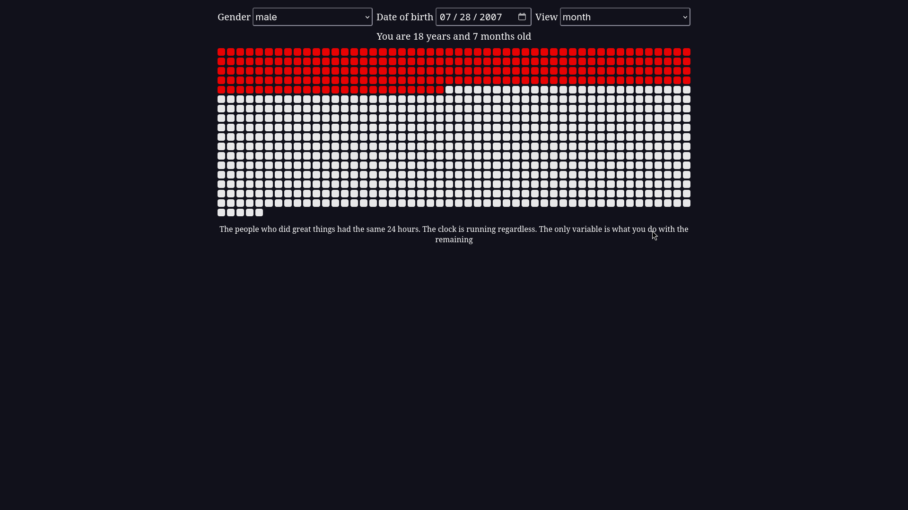

# life-calendar


A memento mori life calendar. Shows your life in months as a dot grid — both your total existence and your actual free time — so you can see exactly how much is gone and how much is left.
Built as a personal motivator.
The same 24 hours that you have is the same 24 hours every person who ever did something remarkable had.

---

## Usage

1. Clone the repository: `git clone https://github.com/Yusufdot101/life-calendar`
2. Enter the directory: `cd life-calendar/single-file`
3. Open the index.html in the browser

---

## Development

```
git clone https://github.com/Yusufdot101/life-calendar
cd life-calendar/single-file
live-server --port 3000 .
```

navigate to [http://localhost:3000/](http://localhost:3000/)
